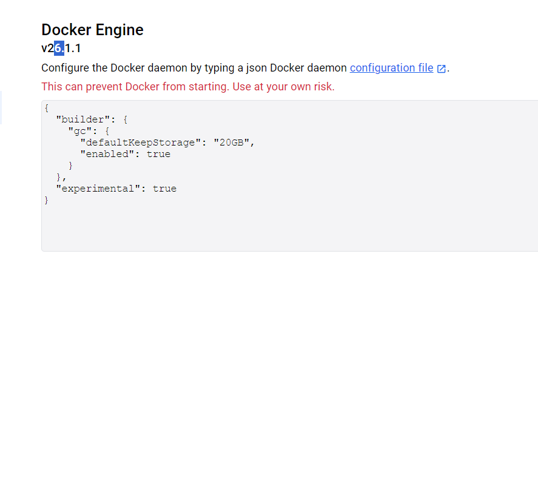
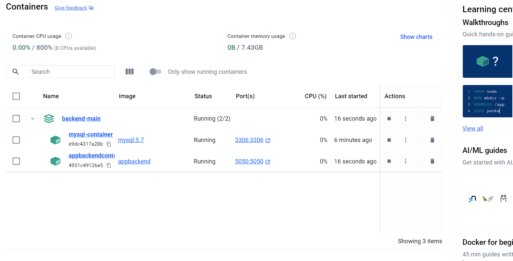
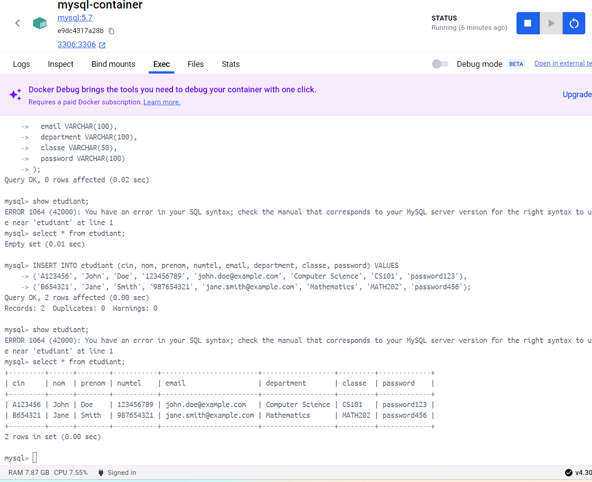
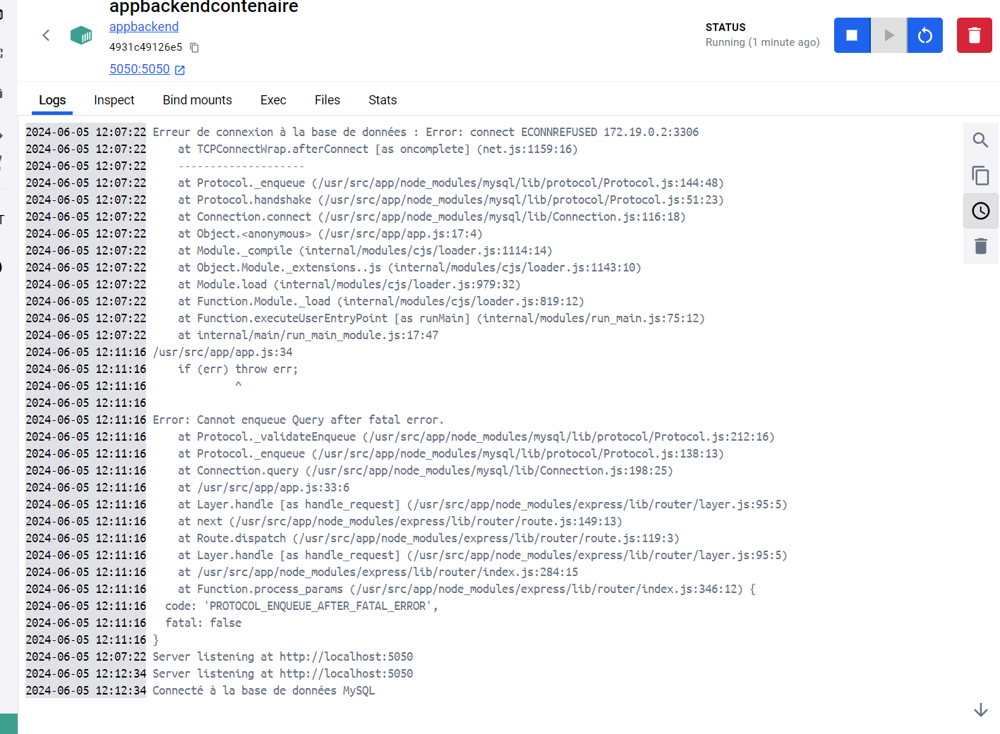
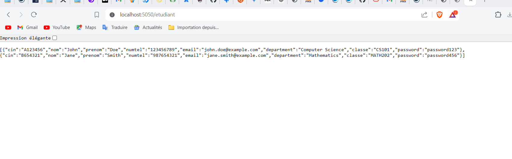
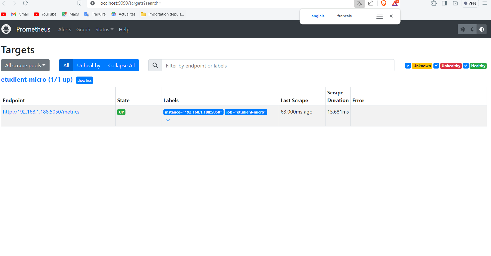
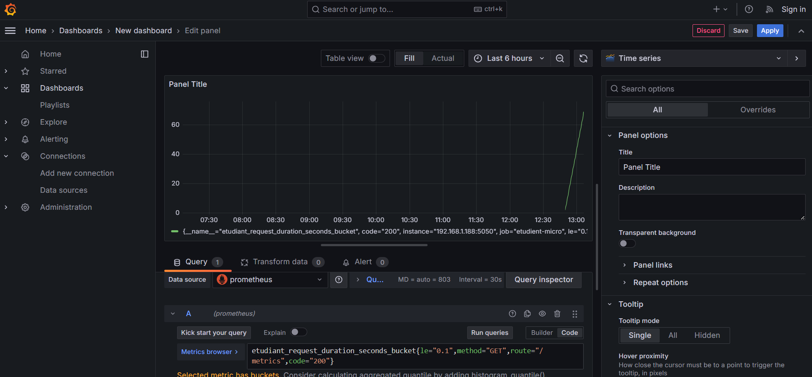
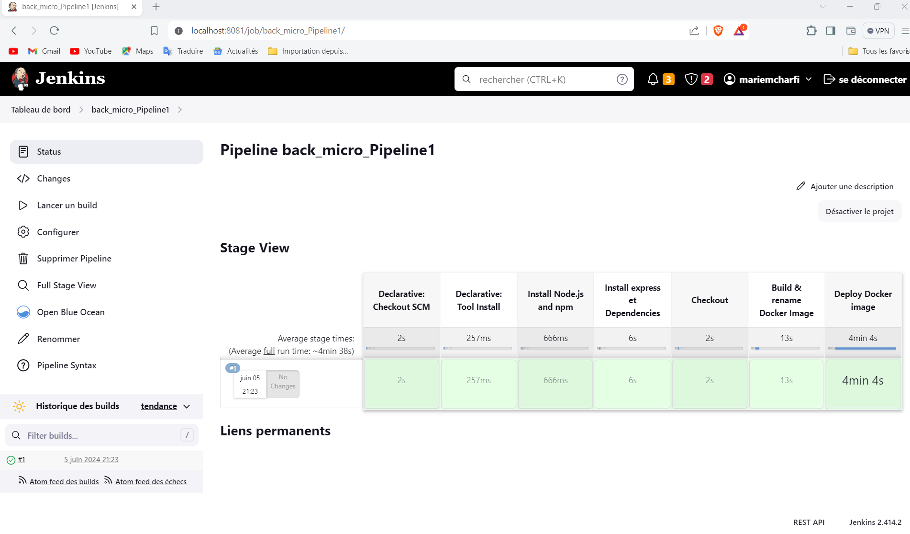
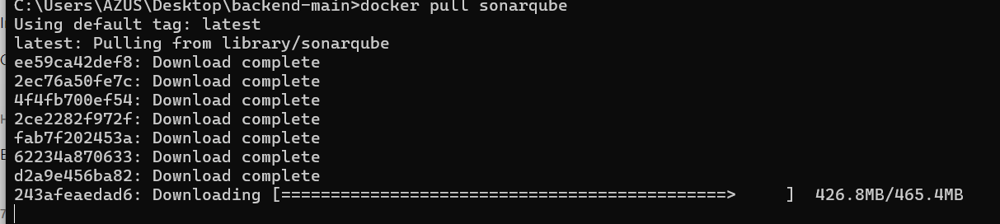
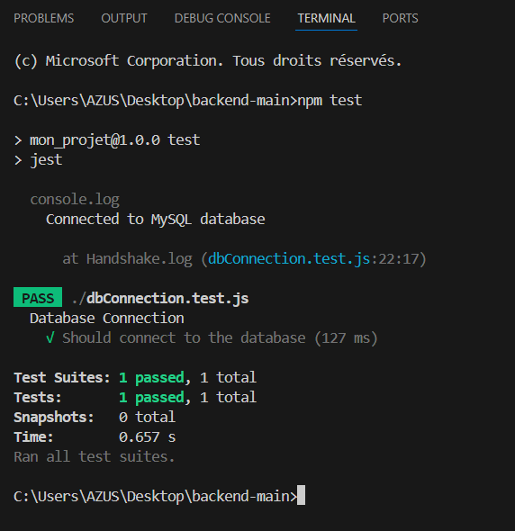

# docker engine 

CREATE TABLE IF NOT EXISTS etudiant (
  cin VARCHAR(20) PRIMARY KEY,
  nom VARCHAR(100),
  prenom VARCHAR(100),
  numtel VARCHAR(15),
  email VARCHAR(100),
  department VARCHAR(100),
  classe VARCHAR(50),
  password VARCHAR(100)
);

 (en va install SonarQub dans image docker pour test )

 pour tester jest de app.js

docker run --rm -p 9090:9090 -v "%cd%/prometheus.yml:/etc/prometheus/prometheus.yml" prom/prometheus:v2.20.1

docker run --rm -p 3000:3000 -e GF_AUTH_DISABLE_LOGIN_FORM=true -e GF_AUTH_ANONYMOUS_ENABLED=true -e GF_AUTH_ANONYMOUS_ORG_ROLE=Admin -v C:\Users\AZUS\Desktop\backend-main\grafana\provisionning\datasources.yml:/etc/grafana/provisionning/datasources/datasources.yml grafana/grafana:latest

